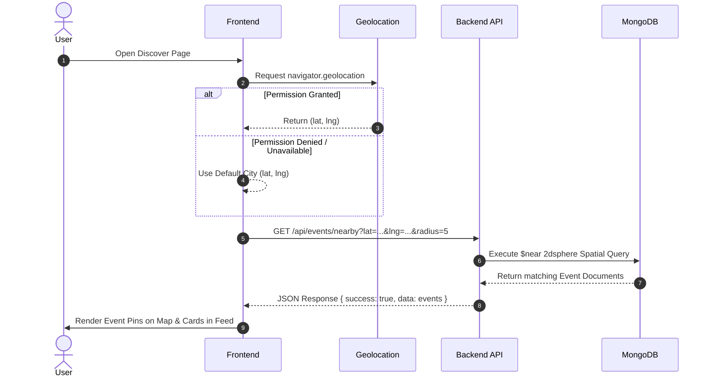
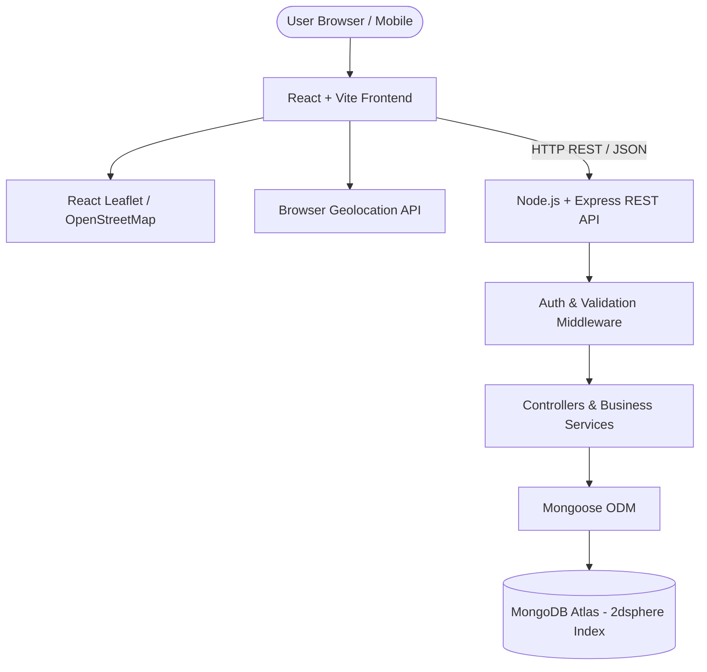
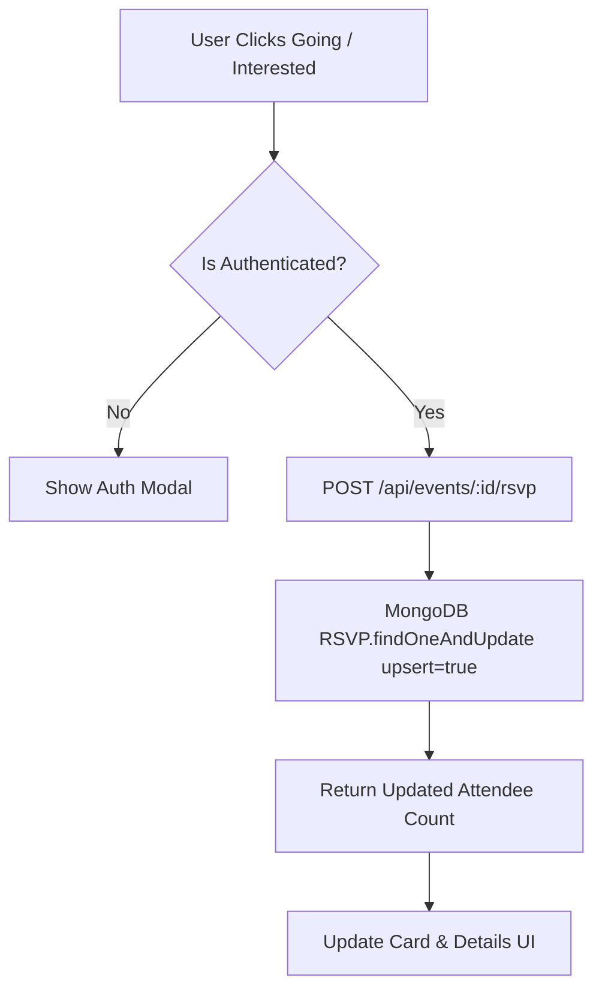

# LocalVibe — Technical Architecture Document

## Executive Summary

LocalVibe is a hyperlocal event discovery platform designed with a **map-first architecture**. Currently, LocalVibe supports events located within India only (Latitude: 6.0°N to 38.0°N, Longitude: 68.0°E to 98.0°E). This document outlines the end-to-end technical system design, data models, geospatial query pipelines, API contracts, security boundaries, and deployment topology.

The architecture emphasizes simplicity, scalability for MVP/portfolio standards, strict backend-enforced security, and high performance for geospatial queries. While the current product scope is India-only, the underlying geospatial engine (MongoDB 2dsphere + GeoJSON) is fully extensible to multi-national deployments in the future.

---

## 1. Architecture Overview

### Conceptual System Flow
```
User Browser
    ↓
React / Vite Frontend (Presentation & UI State)
    ↓  [HTTP REST / JSON]
Node.js + Express Backend (API Routes & Middleware)
    ↓
Controllers & Business Logic Services
    ↓
Mongoose ODM
    ↓
MongoDB Atlas (2dsphere Geospatial Index)
```

### External Services Integration Flow
```
Browser Navigator API  ──> User Coordinates (lat, lng) ──> Frontend / API
OpenStreetMap Tiles    ──> React Leaflet ───────────────> Frontend Map Layer
Geocoding Provider     ──> Address Autocomplete ────────> Backend / Frontend Form
```

### Layer Responsibilities

| Layer | Responsibility |
| :--- | :--- |
| **Presentation Layer** | Renders map markers, event cards, filters, and UI forms using React and React Leaflet. Manages local UI state and user interactions. |
| **API Layer** | Express REST endpoints handling routing, request parsing, authentication checks, parameter validation, and HTTP response formatting. |
| **Business Logic Layer** | Encapsulates domain logic (geospatial query assembly, recommendation scoring, RSVP state transitions, featured event curation). |
| **Data Access Layer** | Mongoose models defining schemas, hooks, static methods, and direct interactions with MongoDB Atlas collections. |
| **Database Layer** | MongoDB Atlas cluster storing document collections with native `2dsphere` spatial indexing. |
| **External Services** | Browser Geolocation API, OpenStreetMap tile servers, and configurable Geocoding/Autocomplete APIs (e.g., Nominatim / Google Places). |

---

## 2. Repository Structure

```
LocalVibe/
│
├── PRD.md
├── Architecture.md
│
├── frontend/
│   ├── package.json
│   ├── vite.config.js
│   ├── index.html
│   └── src/
│       ├── assets/         # Static images, icons, and map markers
│       ├── components/     # Reusable UI components (Navbar, Modal, Card, Pin)
│       ├── pages/          # Top-level page views (Landing, Discover, EventDetails, CreateEvent, MyEvents, Profile, Admin)
│       ├── layouts/        # Page wrappers (MainLayout, AuthLayout, AdminLayout)
│       ├── hooks/          # Custom hooks (useGeolocation, useNearbyEvents, useAuth)
│       ├── services/       # Modularized API HTTP client calls (apiClient, eventService, authService)
│       ├── context/        # React Context providers (AuthContext, ToastContext)
│       ├── utils/          # Pure functions (dateFormatter, distanceCalculator, GeoJSON helpers)
│       ├── constants/      # App constants (Categories, Map defaults, Distance options)
│       ├── styles/         # Global CSS variables, utility classes, and custom map overrides
│       ├── App.jsx         # App router and top-level context providers
│       └── main.jsx        # Application entry point
│
├── backend/
│   ├── package.json
│   ├── server.js           # Server bootstrapper & Express initialization
│   └── src/
│       ├── config/         # Database connection & env variable parsers
│       ├── controllers/    # Request/Response handlers (authController, eventController, rsvpController)
│       ├── middleware/     # Auth checks, error handling, rate limiting, role validators
│       ├── models/         # Mongoose schemas (User.js, Event.js, RSVP.js)
│       ├── routes/         # Express router modules (authRoutes, eventRoutes, rsvpRoutes, adminRoutes)
│       ├── services/       # Core business logic (eventService, geocodingService, recommendationService)
│       ├── utils/          # Backend utilities (jwt, logger, geoUtils)
│       ├── validators/     # Request payload validation schemas (Zod or Joi)
│       └── seed/           # Isolated database seed scripts for target cities
│
└── README.md
```

### Directory Purpose Guidelines
- `frontend/src/services`: Abstracts all `fetch` or `axios` calls into clean async functions. Components never issue raw HTTP fetch logic directly.
- `backend/src/services`: Separates Express request/response code from database logic. Controllers call services to execute business operations.

---

## 3. Frontend Architecture

### Component Hierarchy & Interaction Flow
```
Page (e.g., DiscoverPage)
   │
   ├── Component (e.g., EventFilterBar, EventMap, EventList)
   │      │
   │      └── Custom Hook (e.g., useNearbyEvents)
   │             │
   │             └── Service Module (e.g., eventService.fetchNearby)
   │                    │
   │                    └── Axios / Fetch HTTP Request ──> Backend REST API
```

### Key Responsibilities
- **Pages**: Manage screen layout, assemble sub-components, and orchestrate route params.
- **Components**: Pure presentation units receiving props and triggering callbacks.
- **Hooks**: Encapsulate asynchronous state lifecycle (e.g., browser geolocation tracking, fetching nearby events on map drag).
- **Services**: Handle endpoint URLs, HTTP headers, request data serialization, and response unmarshaling.

---

## 4. Backend Architecture

### Request-Response Processing Pipeline
```
HTTP Request
    ↓
Express Router (`/api/events/nearby`)
    ↓
Middleware Stack (`cors` → `rateLimiter` → `authenticateToken` → `validateRequest`)
    ↓
Controller Handler (`eventController.getNearbyEvents`)
    ↓
Service Layer (`eventService.findNearbyEvents`)
    ↓
Mongoose Model (`Event.find({ location: { $near: ... } })`)
    ↓
MongoDB Atlas Execution
    ↓
JSON Response Output (`{ success: true, data: [...] }`)
```

### Layer Rules
- Routes contain **zero** business logic; they only pair HTTP verbs/paths with middleware and controller methods.
- Middleware handles authentication, authorization (`isAdmin`), request schema validation, and global error catching.
- Controllers extract `req.params`, `req.query`, and `req.body`, delegate to services, and send standard JSON responses.

---

## 5. Database Architecture

MongoDB Atlas is selected as the primary data store due to native GeoJSON support, `$near` / `$geoNear` spatial query acceleration, flexible schema evolution, and seamless Node.js/Mongoose integration.

### Core Collections Overview
```
├── users   # Stores credentials, profile data, and user roles
├── events  # Stores event details, dates, prices, and GeoJSON locations
└── rsvps   # Stores discrete user-to-event attendance records
```

*(Future post-MVP collections: `follows`, `reports`, `notifications`)*

---

## 6. User Model

### Conceptual Mongoose Schema Definition
```javascript
User {
  _id: ObjectId,
  name: String (Required, Trimmed),
  email: String (Required, Unique, Lowercase, Indexed),
  passwordHash: String (Required, Excluded from default queries),
  profileImage: String (URL, Default placeholder),
  bio: String (MaxLength: 500),
  location: {
    city: String,
    coordinates: [Number] // [longitude, latitude] optional home default
  },
  interests: [String], // Array of preferred event categories
  role: String (Enum: ['USER', 'ADMIN'], Default: 'USER'),
  createdAt: Timestamp,
  updatedAt: Timestamp
}
```

### Security & Roles
- Roles (`USER`, `ADMIN`) are enforced at the API middleware level (`requireRole('ADMIN')`).
- Passwords are salted and hashed using `bcryptjs` with a minimum cost factor of 10.

---

## 7. Event Model

### Conceptual Mongoose Schema Definition
```javascript
Event {
  _id: ObjectId,
  title: String (Required, Trimmed, MaxLength: 120),
  description: String (Required, MaxLength: 3000),
  category: String (Required, Indexed, Enum: CategoryList),
  startDate: Date (Required, Indexed),
  endDate: Date (Required),
  location: {
    type: String (Required, Enum: ['Point'], Default: 'Point'),
    coordinates: [Number] (Required), // [longitude, latitude]
    address: String (Required),
    city: String (Indexed)
  },
  price: Number (Required, Min: 0, Default: 0),
  image: String (Required, Image URL),
  organizer: ObjectId (Required, Ref: 'User', Indexed),
  isFeatured: Boolean (Default: false, Indexed),
  status: String (Enum: ['ACTIVE', 'CANCELLED', 'DRAFT'], Default: 'ACTIVE'),
  createdAt: Timestamp,
  updatedAt: Timestamp
}
```

### GeoJSON Coordinate Ordering Standard
> **CRITICAL ARCHITECTURAL REQUIREMENT**:
> GeoJSON coordinate array format MUST strictly follow:
> `coordinates: [longitude, latitude]`
> Example: `[72.8777, 19.0760]` for Mumbai, India.
> Passing `[latitude, longitude]` will cause inverted geographic queries or index rejection.

---

## 8. Geospatial Indexing

To support fast, sub-50ms proximity searches across thousands of event listings, the `location` field in the `Event` schema requires a native MongoDB **`2dsphere`** index.

### Index Creation
```javascript
eventSchema.index({ location: '2dsphere' });
```

### Proximity Query Pipeline (`$near` / `$maxDistance`)
MongoDB expects distance values in **meters**. The backend converts kilometer radius inputs from API parameters to meters before querying:

$$\text{distanceMeters} = \text{radiusKm} \times 1000$$

```javascript
// Query execution inside eventService
const events = await Event.find({
  status: 'ACTIVE',
  location: {
    $near: {
      $geometry: {
        type: 'Point',
        coordinates: [parseFloat(lng), parseFloat(lat)] // [longitude, latitude]
      },
      $maxDistance: radiusKm * 1000 // Convert km to meters
    }
  }
});
```

---

## 9. Nearby Event API Architecture

### Endpoint Specs: `GET /api/events/nearby`

#### Query Parameters
- `lat` (Number, Required): Latitude (-90 to 90)
- `lng` (Number, Required): Longitude (-180 to 180)
- `radius` (Number, Optional, Default: 5): Distance radius in kilometers
- `category` (String, Optional): Filter by event category
- `date` (String, Optional): Enum filter (`today`, `tomorrow`, `weekend`, `upcoming`)
- `price` (String, Optional): Filter (`free`, `paid`)

#### System Processing Sequence
```
1. Client issues: GET /api/events/nearby?lat=19.0760&lng=72.8777&radius=5&category=Music
2. Express Router receives request → Passes to validateNearbyParams middleware.
3. Middleware checks lat (-90..90), lng (-180..180), radius (1..50).
4. Controller extracts query params → Calls eventService.getNearbyEvents().
5. Service constructs GeoJSON query:
   - $geometry: [72.8777, 19.0760]
   - $maxDistance: 5000 meters
   - Applies additional Mongoose match criteria (category = 'Music', status = 'ACTIVE').
6. MongoDB uses 2dsphere index to execute spatial search.
7. Service populates organizer summary info (name, image).
8. Controller returns JSON payload with events array and meta metadata.
```

---

## 10. Event API Architecture

### Endpoint Specifications Summary

| Method | Endpoint | Auth Required | Role / Ownership | Description |
| :--- | :--- | :---: | :---: | :--- |
| `POST` | `/api/auth/register` | No | Public | Register new user account |
| `POST` | `/api/auth/login` | No | Public | Authenticate user & return JWT |
| `GET` | `/api/auth/me` | Yes | Logged-in | Fetch current authenticated profile |
| `GET` | `/api/events` | No | Public | Search/paginate active events |
| `GET` | `/api/events/nearby` | No | Public | Geospatial radius search (`2dsphere`) |
| `GET` | `/api/events/:id` | No | Public | Get single event details |
| `POST` | `/api/events` | Yes | User / Organizer | Create new event listing |
| `PUT` | `/api/events/:id` | Yes | Owner / Admin | Update event details (Ownership checked) |
| `DELETE` | `/api/events/:id` | Yes | Owner / Admin | Delete event listing |
| `POST` | `/api/events/:id/rsvp` | Yes | Logged-in | Create/update RSVP status (`GOING`/`INTERESTED`) |
| `DELETE` | `/api/events/:id/rsvp` | Yes | Logged-in | Remove RSVP record |
| `GET` | `/api/events/:id/attendees`| No | Public | Fetch attendee counts and user list |
| `GET` | `/api/users/me/events` | Yes | Logged-in | Fetch user's RSVPs & created events |
| `GET` | `/api/admin/events` | Yes | Admin Only | Administrative event moderation feed |
| `PATCH` | `/api/admin/events/:id` | Yes | Admin Only | Toggle featured status / moderation state |

---

## 11. Authentication Architecture

LocalVibe uses **JSON Web Token (JWT)** stateless authentication.

```
Client                                  Server
  │                                       │
  ├─── POST /api/auth/login ─────────────►│ Validate email/password
  │    (email, password)                  │ Sign JWT (userId, role, exp: 7d)
  │◄── 200 OK { token, user } ────────────┤
  │                                       │
  ├─── GET /api/events (Protected) ──────►│ Verify Authorization: Bearer <token>
  │    Header: Authorization: Bearer JWT  │ Extract req.user payload
  │◄── 200 OK { data } ───────────────────┤
```

### Security Details
- JWT payload contains: `{ id: user._id, role: user.role }`.
- Tokens expire in 7 days (`expiresIn: '7d'`).
- Auth token stored in client memory / secure browser storage and injected into API requests via Axios HTTP interceptors.

---

## 12. Authorization & Resource Security

Security boundaries are strictly enforced on the **backend**:

1. **Role Validation Middleware (`requireAdmin`)**:
   Checks `req.user.role === 'ADMIN'`. Reject with `403 Forbidden` if validation fails.
2. **Ownership Validation Middleware (`requireEventOwnership`)**:
   ```javascript
   const event = await Event.findById(req.params.id);
   if (event.organizer.toString() !== req.user.id && req.user.role !== 'ADMIN') {
     return res.status(403).json({ success: false, message: 'Unauthorized resource access' });
   }
   ```

---

## 13. RSVP Architecture

RSVPs are stored in a dedicated `RSVP` collection to avoid unbounded array growth inside Event documents.

### Conceptual RSVP Schema
```javascript
RSVP {
  _id: ObjectId,
  user: ObjectId (Required, Ref: 'User', Indexed),
  event: ObjectId (Required, Ref: 'Event', Indexed),
  status: String (Required, Enum: ['GOING', 'INTERESTED']),
  createdAt: Timestamp,
  updatedAt: Timestamp
}
```

### Compound Unique Index Constraint
To guarantee a user has only one active RSVP per event:
```javascript
rsvpSchema.index({ user: 1, event: 1 }, { unique: true });
```
When a user updates from `INTERESTED` to `GOING`, the backend uses `findOneAndUpdate` with `upsert: true`, updating the existing document atomically without creating duplicates.

---

## 14. Social / Friends Architecture (Post-MVP Ready)

To support social indicators such as *"3 friends are going"*:
- Extensible `Follow` model (`follower`, `following`).
- Social discovery service calculates intersection:
  $$\text{FriendsAttending} = \text{Followings}(\text{CurrentUser}) \cap \text{Attendees}(\text{TargetEvent})$$
- Kept isolated from core MVP discovery APIs to maintain maximum performance.

---

## 15. Map Architecture

The map interface relies on **Leaflet** and **React Leaflet** with OpenStreetMap vector tiles.

```
+-------------------------------------------------------------------------+
|  React Leaflet MapContainer (Center: User Location / Default City)      |
|  ├── TileLayer (OpenStreetMap URL Template)                             |
|  ├── Marker (User Location Pin - Blue Pulsing Dot)                      |
|  └── MarkerClusterGroup                                                 |
|      ├── Marker (Event Pin - Category Icon / Default Red)               |
|      │   └── Popup (Event Title, Image, Distance, Price, Detail CTA)    |
|      └── Marker (Featured Event Pin - Gold / Star Badge Visual)         |
+-------------------------------------------------------------------------+
```

### Map State Isolation
Map viewport state (center coordinates, zoom level) is managed in local component hooks (`useMapState`), decoupled from global user authentication state.

---

## 16. User Geolocation Handling

```
                      navigator.geolocation.getCurrentPosition()
                                        │
                 ┌──────────────────────┴──────────────────────┐
                 ▼                                             ▼
          [ SUCCESS ]                                    [ ERROR / DENIED ]
  Obtain (lat, lng)                             Catch Error Code (PERMISSION_DENIED)
  Set userPosition state                        Set locationDenied flag = true
  Center map at user coordinates                Fallback to Default Coordinates (e.g. City Center)
  Trigger fetchNearbyEvents(lat, lng)           Prompt user: "Search Location Manually"
```

---

## 17. Address Search & Geocoding

Organizers search for address strings when creating an event.

```
Organizer types "123 Main St"
       │
   (Debounce 300ms)
       │
   Geocoding API (Nominatim / Google Places)
       │
   Returns suggestions array: [{ display_name, lat, lon }]
       │
   Organizer selects address item
       │
   Sets form state:
     - address: display_name
     - location: { type: 'Point', coordinates: [lon, lat] }
       │
   Interactive mini-map updates marker position for verification
```

---

## 18. Event Discovery Flow



---

## 19. Filter Architecture

All filtering operations that change query parameters are executed **server-side**:

```javascript
// Constructed MongoDB query inside eventService
const query = {
  status: 'ACTIVE',
  location: {
    $near: {
      $geometry: { type: 'Point', coordinates: [lng, lat] },
      $maxDistance: radiusInKm * 1000
    }
  }
};

if (category) query.category = category;
if (price === 'free') query.price = 0;
if (price === 'paid') query.price = { $gt: 0 };
if (dateFilter) query.startDate = buildDateRangeFilter(dateFilter);
```

---

## 20. Featured Events Architecture

- Property: `isFeatured: Boolean` (Default `false`).
- Admin API endpoint (`PATCH /api/admin/events/:id`) toggles `isFeatured`.
- Map Rendering Layer checks `event.isFeatured` to apply custom CSS classes (`marker-featured`), rendering a distinct golden pin with priority z-index.

---

## 21. Recommendation Architecture (Post-MVP Ready)

Rule-based engine (Zero complex AI/ML required):
1. Aggregates categories of user's past `RSVP` entries (`GOING`).
2. Identifies top preferred category (e.g. `Music`).
3. Executes a query for upcoming `Music` events within a 10 km radius of user location.
4. Returns payload formatted for the "Recommended For You" UI widget.

---

## 22. Seed Data Architecture

Database seeding is managed by an isolated CLI script (`backend/src/seed/seedDatabase.js`) and mirrored in the active in-memory development store (`backend/src/services/inMemoryStore.js`):
- Features 30 curated Indian event entities across 11 key regions: **Mumbai, Pune, Thane, Navi Mumbai, Bengaluru, Delhi, Hyderabad, Chennai, Kolkata, Ahmedabad, Jaipur**.
- All coordinates strictly adhere to valid Indian geographic locations in GeoJSON `[longitude, latitude]` format.
- Features 8 development demo accounts with bcrypt-hashed passwords (`password123`):
  - `curator@localvibe.app` (ADMIN / Lead Curator)
  - `demo.mumbai@localvibe.demo` (ORGANIZER - Mumbai Community Events)
  - `demo.pune@localvibe.demo` (ORGANIZER - Pune Local Events)
  - `demo.bengaluru@localvibe.demo` (ORGANIZER - Bengaluru Events Hub)
  - `demo.delhi@localvibe.demo` (ORGANIZER - Delhi Community Collective)
  - `demo.events@localvibe.demo` (ORGANIZER - LocalVibe Demo Organizer)
  - `demo.user1@localvibe.demo` (USER - Aarav Patel)
  - `demo.user2@localvibe.demo` (USER - Ananya Sharma)
- Idempotent execution: Seeding clears existing demo collections and cleanly inserts deterministic documents with valid foreign keys.
- Execution command: `npm run seed` (Explicit development execution; never automatically triggered in production).

---

## 22.1 Authenticated Add to Calendar Architecture

- **Access Level**: Authenticated / Registered Users Only.
- **Client Behavior**:
  - Authenticated user: Clicking "Add to Google Calendar" generates standard Google Calendar URL template with event title, dates, details, and venue address, opening in a new tab.
  - Guest user: Clicking "Add to Google Calendar" intercepts the action, emits a toast notification (`"Please log in to add events to your Google Calendar"`), and opens the `AuthModal` dialog.
- **RSVP Independence**: Calendar actions operate purely on event time/location metadata and do not alter RSVP state or mutate RSVP database records.

---

## 23. Error Handling Architecture

Centralized Express error-handling middleware catches all application errors:

```javascript
// backend/src/middleware/errorHandler.js
module.exports = (err, req, res, next) => {
  const statusCode = err.statusCode || 500;
  const message = err.message || 'Internal Server Error';

  logger.error(`${req.method} ${req.url} - ${message}`);

  res.status(statusCode).json({
    success: false,
    message: process.env.NODE_ENV === 'production' && statusCode === 500
      ? 'An unexpected server error occurred.'
      : message
  });
};
```

---

## 24. Request Validation Architecture

All incoming request payloads are validated prior to controller execution using a validation layer (e.g. Zod / Joi).

### Key Validation Constraints
- `latitude`: Number between `-90` and `90`.
- `longitude`: Number between `-180` and `180`.
- `startDate`: Valid ISO Date String, must be `>= current time`.
- `endDate`: Valid ISO Date String, must be `>= startDate`.
- `price`: Number `>= 0`.

---

## 25. Security Architecture

- **Password Storage**: `bcryptjs` hashing (10 salt rounds).
- **Environment Variables**: Managed via `.env` locally and deployment platform dashboards in production. `.env` is listed in `.gitignore`.
- **CORS Configuration**: Restricts origins to configured client URL (`CLIENT_URL`).
- **HTTP Headers Security**: `helmet` middleware used to set protective HTTP headers.

---

## 26. Environment Configuration

### Backend Environment Variables (`backend/.env.example`)
```env
PORT=5000
NODE_ENV=development
MONGODB_URI=mongodb+srv://<username>:<password>@cluster.mongodb.net/localvibe?retryWrites=true&w=majority
JWT_SECRET=super_secret_jwt_key_change_in_production
CLIENT_URL=http://localhost:5173
GEOCODING_API_KEY=optional_geocoding_api_key
```

### Frontend Environment Variables (`frontend/.env.example`)
```env
VITE_API_BASE_URL=http://localhost:5000/api
VITE_DEFAULT_MAP_CENTER_LAT=19.0760
VITE_DEFAULT_MAP_CENTER_LNG=72.8777
```

---

## 27. Standardized API Response Architecture

### Success Response Format
```json
{
  "success": true,
  "data": {},
  "message": "Operation completed successfully"
}
```

### Paginated List Response Format
```json
{
  "success": true,
  "data": [],
  "pagination": {
    "page": 1,
    "limit": 20,
    "total": 85,
    "totalPages": 5
  }
}
```

### Error Response Format
```json
{
  "success": false,
  "message": "Invalid credentials provided"
}
```

---

## 28. Pagination & Result Capping

To maintain high performance and prevent map marker cluttering:
- Standard list queries enforce `limit=20` by default.
- Geospatial radius queries hard-cap responses to a maximum of **100 event markers** per request payload.

---

## 29. Performance Architecture

- **Database**: `2dsphere` spatial index + index on `category`, `startDate`, and `status`.
- **Frontend Optimization**: Search inputs debounced by `300ms`.
- **Assets**: Event card images loaded lazily with CSS loading placeholders.

---

## 30. Frontend State Management

- **AuthContext**: Holds `currentUser`, `isAuthenticated`, `token`, `login()`, `logout()`.
- **Local Page State**: Handles search terms, active filter selections, pagination step, and modal open states.
- **Service Layer**: Handles HTTP requests independently, keeping components clean.

---

## 31. Deployment Architecture

```
User Web Browser
       │
  ┌────┴───────────────────────────┐
  ▼                                ▼
[ Vercel CDN ]            [ Render Cloud Service ]
Frontend App              Express REST API
(React + Vite static)     (Node.js Server)
                                   │
                                   ▼
                        [ MongoDB Atlas Cluster ]
                        Managed Mongo Database
```

---

## 32. CORS Architecture

CORS middleware restricts allowed cross-origin requests:

```javascript
// backend/server.js
const cors = require('cors');

app.use(cors({
  origin: process.env.CLIENT_URL || 'http://localhost:5173',
  credentials: true,
  methods: ['GET', 'POST', 'PUT', 'PATCH', 'DELETE']
}));
```

---

## 33. Image Handling Architecture

For MVP simplicity and performance:
- Event entity schema stores high-performance image URLs (`String`).
- Event creation form accepts direct image URL input or utilizes cloud uploads (e.g. Cloudinary unsigned upload preset) returning a secure HTTPS CDN URL.

---

## 34. Observability & Logging Architecture

Backend logs events using a structured logging utility:
- **Logged Events**: Server boot, database connections, unhandled exceptions, admin actions.
- **Redacted Information**: Passwords, JWT secrets, authorization headers, and raw user credentials are strictly filtered out of log outputs.

---

## 35. Architecture Principles

1. **Map-First Priority**: The user interface revolves around geographic visualization.
2. **Sub-50ms Spatial Search**: All proximity calculations are offloaded to MongoDB's native `2dsphere` index.
3. **Backend-Enforced Security**: Roles and resource ownership are validated exclusively on the server.
4. **GeoJSON Precision**: Coordinates must strictly follow `[longitude, latitude]`.
5. **Clean Layered Separation**: Zero route business logic; components delegate HTTP requests to dedicated services.
6. **Mobile-First UX**: Responsive layouts built for touch map navigation.
7. **Stateless Auth**: Scalable JWT-based authentication.
8. **Pragmatic Extensibility**: Extensible schemas without premature over-engineering.

---

## 36. Architecture Decision Records (ADRs)

- **ADR-001**: React + Vite for Frontend (Fast HMR, modern bundling, lightweight footprint).
- **ADR-002**: Express.js REST API (Simple routing, widespread adoption, flexible middleware ecosystem).
- **ADR-003**: MongoDB Atlas with Mongoose (Flexible schema, native GeoJSON support, `$near` query acceleration).
- **ADR-004**: MongoDB `2dsphere` Spatial Indexing (Required for fast radius-based proximity filtering).
- **ADR-005**: Leaflet & React Leaflet (Lightweight, open-source, mobile touch-friendly map renderer).
- **ADR-006**: OpenStreetMap Tiles (Open tile server eliminating expensive map licensing for MVP).
- **ADR-007**: Separate RSVP Collection (Prevents unbounded array growth inside event documents).
- **ADR-008**: Rule-Based Category Recommendations (Eliminates AI/ML complexity while providing context-driven suggestions).

---

## 37. Architecture Diagrams

### 37.1 High-Level System Architecture


### 37.2 Event Creation Architecture Flow
```mermaid
flowchart LR
    Form[Organizer Event Form] --> AddrInput[Address Input]
    AddrInput --> Geocoder[Geocoding API]
    Geocoder --> LatLng[Extract Longitude & Latitude]
    LatLng --> GeoJSON[Format GeoJSON: Point, coordinates: [lng, lat]]
    GeoJSON --> PostReq[POST /api/events]
    PostReq --> BackendVal[Backend Payload Validation]
    BackendVal --> DB[(MongoDB Save Event)]
```

### 37.3 RSVP Processing Flow


---

## 38. Future Extensibility

The system architecture is structured to seamlessly accommodate future post-MVP enhancements:
- **Social Graph**: Adding `Follow` models for friend activity feeds.
- **Third-Party Auth**: OAuth2 integration (Google Login).
- **Notifications**: WebSocket / Push notification service for event updates.
- **Monetization**: Stripe gateway integration for promoted featured listings.

---

## 39. Architecture Boundaries

`Architecture.md` defines system boundaries, technical stack choices, database schemas, API contracts, security models, and deployment topologies.

It does **NOT** contain:
- CSS stylesheets or component visual specs (defined in `Design.md`).
- Step-by-step developer task lists (defined in `Phases.md`).
- Code style and git commit rules (defined in `Rules.md`).
- Application source code implementation files.

---

## 40. Final Architecture Verification Checklist

- [x] **Frontend-Backend Communication**: Documented REST API contracts over HTTP JSON.
- [x] **Database Communication**: Mongoose ODM connecting to MongoDB Atlas.
- [x] **Geospatial Storage Format**: GeoJSON Point format strictly enforcing `[longitude, latitude]`.
- [x] **Nearby Proximity Search**: MongoDB `$near` operator over a `2dsphere` index.
- [x] **Map Integration**: Leaflet and React Leaflet rendering OpenStreetMap tiles.
- [x] **Event Creation & Geocoding**: Address autocomplete flow converting strings to `[lng, lat]` coordinates.
- [x] **RSVP Storage Strategy**: Separate collection with compound unique index `(user, event)`.
- [x] **Authentication & Authorization**: Stateless JWT tokens + backend middleware checks (`requireAdmin`, ownership verification).
- [x] **Deployment Topology**: Vercel (Frontend) + Render (Backend) + MongoDB Atlas (Database).
