# LocalVibe — Implementation Roadmap & Phases

## 1. Purpose & Overview

`Phases.md` defines the official, step-by-step implementation roadmap for **LocalVibe**. It details the exact sequence of engineering phases, task dependencies, deliverables, and definitions of done required to build a production-grade, map-first hyperlocal event discovery platform.

The roadmap is specifically designed for a practical **4-Week Full Stack Internship Timeline**, progressing systematically:

`Project Foundation` → `Database & Geospatial Backend` → `Authentication` → `UI Design System` → `Map & Discovery Experience` → `Event Details` → `Event Creation` → `RSVP System` → `My Events` → `User Profile` → `Featured Events` → `Social Discovery` → `Recommendations` → `Admin Dashboard` → `Polish & Optimizations` → `Security Audit` → `Integration Testing` → `Deployment`

---

## 2. Core Development Principles

1. **Incremental Working Delivery**: Every phase must produce a fully testable, functional slice of the application.
2. **Continuous Verification**: Features are verified locally at the end of each phase before proceeding.
3. **Zero Broken Dependencies**: Never advance to a higher-level phase (e.g. Map UI) while a foundational layer (e.g. Geospatial API) is unstable or failing.
4. **Stitch Visual Compliance**: UI components implemented in frontend phases must strictly mirror the approved **Stitch.ai** visual mockups without copy-pasting Stitch-generated raw code.

---

## 3. Standard Phase Structure

Every phase in this document adheres to the following specification template:
- **Objective**: Scope of what will be built.
- **Dependencies**: Prerequisite phases.
- **Tasks**: Granular action items across Frontend, Backend, Database, API, and UI/UX.
- **Testing**: Phase-specific local verification requirements.
- **Deliverables**: Tangible assets created upon completion.
- **Definition of Done**: Hard completion criteria.
- **Risks & Notes**: Architectural or implementation guardrails.

---

## 4. Phase Breakdown

---

### Phase 0 — Project Foundation

#### Objective
Establish the repository directory structure, development scripts, database connection configs, environment templates, and basic client-server health checks.

#### Dependencies
- None (Baseline setup).

#### Tasks
- Initialize `frontend/` using Vite with React + React Router.
- Initialize `backend/` using Node.js + Express.js.
- Create root `.env.example` and backend/frontend `.env` templates.
- Configure `.gitignore` to protect `.env`, `node_modules`, and build artifacts.
- Implement backend `server.js` with CORS, body-parser, and global error middleware.
- Configure Mongoose connection module in `backend/src/config/db.js`.
- Create GET `/api/health` sanity endpoint.

#### Frontend
- React + Vite initialization, React Router setup, global CSS setup (`styles/globals.css`).

#### Backend
- Express server configuration, error middleware, health controller.

#### Database
- MongoDB Atlas connection setup.

#### API
- `GET /api/health` → Returns `{ success: true, message: "LocalVibe API active" }`.

#### UI/UX
- Basic root layout wrapper with header/footer shell.

#### Testing
- Verify `npm run dev` boots frontend on port 5173.
- Verify backend boots on port 5000 and connects to MongoDB Atlas.
- Verify GET `/api/health` returns `200 OK`.

#### Deliverables
- Functional development workspace foundation.

#### Definition of Done
- Both client and server boot cleanly and communicate over HTTP with active database connection.

---

### Phase 1 — Database & Geospatial Event Backend

#### Objective
Build the core event data models, GeoJSON location structures, MongoDB `2dsphere` spatial indexes, CRUD controllers, and geospatial `$near` radius search endpoints. Seed initial target cities.

#### Dependencies
- Phase 0 (Project Foundation).

#### Tasks
- Define `User`, `Event`, and `RSVP` Mongoose models.
- Implement GeoJSON `Point` schema on `Event.location`: `coordinates: [longitude, latitude]`.
- Apply `2dsphere` spatial index on `Event.location`.
- Implement `Event` CRUD services and controllers.
- Build geospatial search pipeline (`GET /api/events/nearby`).
- Build database seeding script (`backend/src/seed/seedDatabase.js`) for Mumbai, Pune, NYC, and London.

#### Frontend
- None (Backend focused phase).

#### Backend
- Controllers (`eventController.js`), Services (`eventService.js`), Models (`User.js`, `Event.js`, `RSVP.js`).

#### Database
- Mongoose schemas + `2dsphere` spatial index execution.

#### API
- `GET /api/events` (Search & Paginate)
- `GET /api/events/nearby?lat=...&lng=...&radius=5` (Geospatial radius search)
- `GET /api/events/:id` (Single event view)
- `POST /api/events` (Create event)
- `PUT /api/events/:id` (Update event)
- `DELETE /api/events/:id` (Delete event)

#### Testing
- Execute spatial query `GET /api/events/nearby?lat=19.0760&lng=72.8777&radius=5` and verify returned events are within 5 km.
- Verify coordinates out of radius are excluded.
- Verify coordinate order is strictly `[longitude, latitude]`.
- Verify database seed script populates test data cleanly.

#### Deliverables
- Working geospatial event REST API with rich seed data.

#### Definition of Done
- Geospatial radius API returns accurate events sub-50ms using `2dsphere` index.

---

### Phase 2 — Authentication Foundation

#### Objective
Build stateless JWT user authentication, password hashing, and role-based backend authorization middleware.

#### Dependencies
- Phase 1 (Database & Models).

#### Tasks
- Implement user registration (`bcryptjs` password hashing).
- Implement login endpoint returning JWT token.
- Build `authenticateToken` middleware for protected routes.
- Build `requireRole('ADMIN')` authorization middleware.
- Build `GET /api/auth/me` endpoint.
- Setup `AuthContext` in React frontend.

#### API
- `POST /api/auth/register`
- `POST /api/auth/login`
- `GET /api/auth/me`

#### Testing
- Test successful user registration & login.
- Test duplicate email registration rejection.
- Test protected endpoints without Bearer token (Expect `401 Unauthorized`).
- Test protected endpoints with valid token (Expect `200 OK`).

#### Deliverables
- Secure authentication system with client-side context.

#### Definition of Done
- User tokens issue correctly, expire in 7 days, and backend middleware strictly validates protected endpoints.

---

### Phase 3 — LocalVibe Design System & UI Foundation

#### Objective
Construct the reusable UI component library based on the approved **Stitch.ai** visual design reference (without copy-pasting raw Stitch code).

#### Dependencies
- Phase 0 (Frontend Setup).

#### Tasks
- Define CSS design tokens (colors, gradients, typography, shadows, border radii).
- Build reusable UI components: `Button`, `Input`, `Card`, `Modal`, `Badge`, `Chip`, `Toast`, `Avatar`, `Skeleton`.
- Build navigation shell: `Navbar`, `MobileNav`, `Footer`.
- Ensure component accessibility (focus rings, contrast ratios, tap targets).

#### UI/UX
- Clean, modern, vibrant visual hierarchy mirroring Stitch mockups.

#### Testing
- Verify component responsiveness across Desktop, Tablet, and Mobile viewports.

#### Deliverables
- Reusable UI component design system (`frontend/src/components`).

#### Definition of Done
- All base components render cleanly, respond to props, and support dark/vibrant styling rules.

---

### Phase 4 — Discover / Map Experience

#### Objective
Build the core map-first event discovery experience using Leaflet, React Leaflet, and OpenStreetMap tiles.

#### Dependencies
- Phase 1 (Geospatial API), Phase 3 (Design System).

#### Tasks
- Integrate `Leaflet` and `React Leaflet` in `frontend/src/components/Map`.
- Implement `useGeolocation` custom hook (`navigator.geolocation`).
- Render user location pin (blue pulsing indicator).
- Fetch nearby events via `eventService.fetchNearby()` on load & radius change.
- Render event markers with category-specific pin styling.
- Create marker popups with event thumbnail, title, distance, price, and CTA link.
- Build filter toolbar (Category chips, distance radius dropdown, date preset filters, search input).
- Build responsive split view for Desktop (40% List / 60% Map) and mobile view switcher.

#### UI/UX
- Map-first interface with fluid pin popups and smooth panning/zooming.

#### Testing
- Test with browser location granted (Centers map on user position).
- Test with location denied (Falls back gracefully to default city center with warning toast).
- Verify marker clicks open event popup correctly.
- Verify filtering updates markers and card list simultaneously.

#### Deliverables
- Functional map-first discovery experience (`DiscoverPage.jsx`).

#### Definition of Done
- Users can view current location, explore nearby event pins, filter by category/distance, and open event details.

---

### Phase 5 — Event Details

#### Objective
Build the comprehensive event details view page.

#### Dependencies
- Phase 4 (Discover Map).

#### Tasks
- Build `EventDetailsPage.jsx`.
- Render hero image banner, category badge, and featured indicator.
- Display event date/time, price tag, detailed description, and organizer summary.
- Render mini-map showing exact event address location pin.
- Integrate RSVP control bar (Going / Interested buttons).
- Display attendee counters and user attendee list.

#### Testing
- Test with valid event ID (Renders full details).
- Test with non-existent event ID (Renders clean `404 Event Not Found` state).

#### Deliverables
- Complete event details view (`EventDetailsPage.jsx`).

#### Definition of Done
- Event information, organizer details, interactive mini-map, and RSVP controls load cleanly.

---

### Phase 6 — Event Creation

#### Objective
Enable authenticated organizers/users to create and publish events with address geocoding and map position preview.

#### Dependencies
- Phase 2 (Auth), Phase 5 (Details).

#### Tasks
- Build `CreateEventPage.jsx` multi-step form.
- Integrate address search autocomplete using geocoding service abstraction (`geocodingService.js`).
- Convert selected address into GeoJSON `[longitude, latitude]` Point coordinates.
- Render interactive map preview showing pinned address position.
- Validate inputs (Title, description, category, dates, price, address).
- Submit `POST /api/events` payload and redirect to published event details page.

#### Testing
- Verify form validates missing required fields or end date before start date.
- Verify selected address resolves coordinates correctly and updates map pin preview.
- Verify published event immediately appears on nearby discovery map.

#### Deliverables
- Persistent event creation workflow (`CreateEventPage.jsx`).

#### Definition of Done
- Authenticated users can search an address, confirm map position preview, publish an event, and view it live on the map.

---

### Phase 7 — RSVP System

#### Objective
Implement persistent RSVP functionality allowing users to indicate attendance (`GOING`, `INTERESTED`).

#### Dependencies
- Phase 2 (Auth), Phase 5 (Event Details).

#### Tasks
- Build RSVP backend controller and service layer.
- Enforce compound unique index `{ user: 1, event: 1 }` in MongoDB.
- Build `POST /api/events/:id/rsvp` and `DELETE /api/events/:id/rsvp` endpoints.
- Connect frontend RSVP buttons on Event Details and Event Cards.
- Implement instant local UI counter updates + backend sync.

#### Testing
- Test toggling `GOING` → `INTERESTED` (Updates existing record without creating duplicates).
- Test un-RSVP action (Removes record and decrements counter).
- Verify unauthenticated RSVP attempts trigger login modal.

#### Deliverables
- Functional RSVP system (`rsvpController.js`, RSVP UI controls).

#### Definition of Done
- Users can set, switch, and remove RSVPs with real-time attendee counter updates and database persistence.

---

### Phase 8 — My Events

#### Objective
Provide users with a centralized dashboard tracking their RSVP'd and created events.

#### Dependencies
- Phase 7 (RSVP), Phase 6 (Event Creation).

#### Tasks
- Build `MyEventsPage.jsx` with tabbed navigation: `Going`, `Interested`, `Created`.
- Fetch user RSVPs (`GET /api/users/me/events`).
- Render event card lists for each tab.
- Provide organizer management actions on `Created` tab (Edit / Delete event).

#### Testing
- Verify RSVP'd events appear under correct tabs (`Going` / `Interested`).
- Verify cancelling RSVP removes event from `My Events`.
- Verify created events render with edit/delete controls for author.

#### Deliverables
- User event activity hub (`MyEventsPage.jsx`).

#### Definition of Done
- Tabbed interface displays accurate user RSVPs and created events with management actions.

---

### Phase 9 — User Profile

#### Objective
Build user profile management and public user summary view.

#### Dependencies
- Phase 2 (Auth).

#### Tasks
- Build `ProfilePage.jsx`.
- Render avatar, bio, home city location, category interests, and activity stats.
- Implement profile edit form (`PUT /api/users/me`).

#### Testing
- Test updating profile name, bio, and interests.
- Verify updated information persists in database and context.

#### Deliverables
- User profile page (`ProfilePage.jsx`).

#### Definition of Done
- Users can view and update their profile details and preferred interests.

---

### Phase 10 — Featured Events

#### Objective
Add featured event curation capabilities with distinctive visual map pins and card badges.

#### Dependencies
- Phase 4 (Map), Phase 13 (Admin).

#### Tasks
- Utilize `isFeatured: Boolean` model field.
- Apply backend authorization on featured status toggling (`requireRole('ADMIN')`).
- Custom style featured map markers (Golden pin / pulse visual).
- Add featured badge to event cards.

#### Testing
- Verify non-admin users cannot set `isFeatured: true` via API requests.
- Verify admin user can toggle featured state cleanly.
- Verify featured map pins render distinct visual treatment.

#### Deliverables
- Featured event curation system.

#### Definition of Done
- Admins can feature events, and featured events render prominent golden markers on discovery maps.

---

### Phase 11 — Social Discovery (Post-MVP Ready)

#### Objective
Add social attendee indicators ("3 friends are going") based on verified user follow graphs.

#### Dependencies
- Phase 7 (RSVP), Phase 9 (Profile).

#### Tasks
- Implement `Follow` schema (`follower`, `following`).
- Build follow/unfollow API endpoints.
- Calculate social attendee intersection on event details.
- Render friend attendee badges on event cards.

#### Testing
- Test follow/unfollow actions.
- Verify "friends going" count includes ONLY verified connected users.

#### Deliverables
- Social event discovery features.

#### Definition of Done
- Users can follow peers and view friend attendance indicators on local events.

---

### Phase 12 — Rule-Based Recommendations

#### Objective
Provide context-driven event recommendations without AI/ML complexity.

#### Dependencies
- Phase 7 (RSVP), Phase 1 (Geospatial API).

#### Tasks
- Build `recommendationService.js` in backend.
- Aggregate category frequency of user's past `GOING` RSVPs.
- Query upcoming events in top category within 10 km radius.
- Render "Recommended For You" carousel widget on Landing and Discover pages.

#### Testing
- Verify user with past Jazz RSVPs receives upcoming Music recommendations nearby.
- Verify fallback recommendations for new users with zero history.

#### Deliverables
- Personalized rule-based recommendation service (`GET /api/events/recommendations`).

#### Definition of Done
- System provides relevant category/distance recommendations based on user RSVP history.

---

### Phase 13 — Admin Dashboard

#### Objective
Build administrative platform moderation and management dashboard protected by backend role checks.

#### Dependencies
- Phase 2 (Auth), Phase 10 (Featured).

#### Tasks
- Build `AdminDashboardLayout.jsx` and pages: `Overview`, `UserManagement`, `EventManagement`, `Reports`.
- Implement `GET /api/admin/stats` metrics summary endpoint.
- Implement user block/unblock actions.
- Implement event moderation/deletion actions.
- Enforce `requireRole('ADMIN')` middleware across all admin routes.

#### Testing
- Verify non-admin users attempting to access `/api/admin/*` receive `403 Forbidden`.
- Verify admin can moderate events and manage user roles.

#### Deliverables
- Protected administration platform (`AdminDashboard.jsx`).

#### Definition of Done
- Admins can manage platform metrics, moderate events, feature listings, and manage user accounts securely.

---

### Phase 14 — UI Polish: Error, Loading & Empty States

#### Objective
Ensure production-ready visual feedback across all app states.

#### Dependencies
- Phases 3–13.

#### Tasks
- Implement Skeleton loading cards for Event Cards, Map Tiles, and Details pages.
- Design empty states for: No Nearby Events, No RSVPs, No Created Events, No Search Results.
- Integrate global Toast notification system for async feedback.

#### Testing
- Intentionally trigger network offline, location denial, and zero search matches to verify recovery UI.

#### Deliverables
- Polished loading, empty, and error feedback system.

#### Definition of Done
- Zero blank screens during async loading or error scenarios.

---

### Phase 15 — Responsive & Accessibility Polish

#### Objective
Refine mobile touch usability and accessibility standards.

#### Dependencies
- Phase 14.

#### Tasks
- Audit touch targets (min `44x44px`) on mobile viewports.
- Verify keyboard navigation (`Tab` focus rings, modal `Escape` key listeners).
- Verify WCAG AA color contrast ratios across dark/vibrant themes.

#### Testing
- Test full discovery flow on simulated iPhone/Android mobile viewports.

#### Deliverables
- Responsive and accessible frontend.

#### Definition of Done
- Mobile layout operates smoothly with zero horizontal scroll leaks or small tap targets.

---

### Phase 16 — Performance Optimization

#### Objective
Optimize spatial queries, rendering speeds, and network request payloads.

#### Dependencies
- Phase 1 (Backend), Phase 4 (Map).

#### Tasks
- Audit `2dsphere` query execution time (`explain('executionStats')`).
- Apply payload debouncing (300ms) to search inputs.
- Lazy-load image thumbnails.
- Cap map marker payload to max 100 pins per request.

#### Testing
- Benchmark nearby API query execution time (< 50ms).
- Verify map remains responsive during rapid zoom/pan operations.

#### Deliverables
- High-performance web application.

#### Definition of Done
- Sub-50ms backend spatial queries and 60fps frontend map rendering.

---

### Phase 17 — Security Audit

#### Objective
Execute comprehensive pre-deployment security review.

#### Dependencies
- All prior phases.

#### Tasks
- Verify secret keys are isolated in `.env` files and omitted from Git repositories.
- Audit CORS configuration (`CLIENT_URL` restricted).
- Verify input sanitization and parameter validation across all POST/PUT routes.
- Verify password hashing and JWT token expiration.

#### Testing
- Execute manual penetration tests against protected endpoints without tokens or ownership claims.

#### Deliverables
- Security-audited codebase.

#### Definition of Done
- Zero plain text secrets in code, active backend authorization, and zero security vulnerabilities.

---

### Phase 18 — Full Integration Testing

#### Objective
Verify the end-to-end user journey across all application flows.

#### Dependencies
- Phases 0–17.

#### Tasks
- Execute full integration walk-through: Register → Login → Geolocation → Map Discovery → Filter → Details → RSVP → My Events → Create Event → Map Pin Verification → Profile.
- Execute full admin walk-through: Admin Login → Dashboard → Moderate Event → Feature Event.

#### Testing
- Comprehensive manual end-to-end regression testing.

#### Deliverables
- Fully verified production candidate.

#### Definition of Done
- Complete end-to-end user and admin workflows pass cleanly without errors.

---

### Phase 19 — Deployment Preparation

#### Objective
Prepare production build scripts, environment variable lists, and deployment configurations.

#### Dependencies
- Phase 18.

#### Tasks
- Build production frontend bundle (`npm run build`).
- Verify production Express static asset handling / CORS settings.
- Prepare deployment checklists for Vercel (Frontend), Render (Backend), and MongoDB Atlas (Database).

#### Testing
- Test local production build preview (`vite preview` / `NODE_ENV=production node server.js`).

#### Deliverables
- Production-ready build artifacts and environment checklists.

#### Definition of Done
- Frontend and backend production builds compile without errors or missing dependencies.

---

### Phase 20 — Deployment & Final Verification

#### Objective
Deploy application to production hosting platforms upon explicit user instruction.

#### Dependencies
- Phase 19 + Explicit User Approval.

#### Tasks
- Deploy Backend to **Render**.
- Deploy Frontend to **Vercel**.
- Connect production **MongoDB Atlas** cluster.
- Configure production environment variables in hosting dashboards.
- Perform live smoke tests on production domain.

#### Testing
- Verify production SSL certificates, CORS, geolocation permissions, map rendering, and live database persistence.

#### Deliverables
- Live deployed LocalVibe web application.

#### Definition of Done
- LocalVibe is accessible live on web and mobile devices with full geospatial event discovery working end-to-end.

---

## 5. Phase Dependency Graph

```mermaid
flowchart TD
    P0[Phase 0: Project Foundation] --> P1[Phase 1: Database & Geospatial Backend]
    P0 --> P3[Phase 3: Design System]
    P1 --> P2[Phase 2: Authentication]
    P1 --> P4[Phase 4: Discover / Map Experience]
    P3 --> P4
    P2 --> P5[Phase 5: Event Details]
    P4 --> P5
    P2 --> P6[Phase 6: Event Creation]
    P5 --> P6
    P5 --> P7[Phase 7: RSVP System]
    P7 --> P8[Phase 8: My Events]
    P6 --> P8
    P2 --> P9[Phase 9: User Profile]
    P7 --> P10[Phase 10: Featured Events]
    P7 --> P11[Phase 11: Social Discovery]
    P7 --> P12[Phase 12: Recommendations]
    P2 --> P13[Phase 13: Admin Dashboard]
    P10 --> P13
    P13 --> P14[Phase 14: UI Polish]
    P14 --> P15[Phase 15: Responsive & Accessibility]
    P15 --> P16[Phase 16: Performance Optimization]
    P16 --> P17[Phase 17: Security Audit]
    P17 --> P18[Phase 18: Full Integration Testing]
    P18 --> P19[Phase 19: Deployment Preparation]
    P19 --> P20[Phase 20: Deployment & Verification]
```



---

## 6. Four-Week Internship Schedule Mapping

```
WEEK 1: BACKEND FOUNDATION & GEOSPATIAL API
├── Phase 0: Project Foundation
├── Phase 1: Database & Geospatial Event Backend
└── Phase 2: Authentication Foundation

WEEK 2: MAP INTERFACE & DISCOVERY UX
├── Phase 3: LocalVibe Design System & UI Foundation
├── Phase 4: Discover / Map Experience
└── Phase 5: Event Details

WEEK 3: CREATION, RSVP & USER ACTIVITY
├── Phase 6: Event Creation
├── Phase 7: RSVP System
├── Phase 8: My Events
└── Phase 9: User Profile

WEEK 4: CURATION, POLISH, AUDIT & DEPLOYMENT
├── Phase 10: Featured Events
├── Phase 11: Social Discovery (Post-MVP)
├── Phase 12: Recommendations
├── Phase 13: Admin Dashboard
├── Phase 14-16: UI Polish, Responsive & Performance Optimization
├── Phase 17-18: Security Audit & Integration Testing
└── Phase 19-20: Deployment Preparation & Live Release
```

---

## 7. MVP Feature Scope Priority

### MUST HAVE (MVP Baseline)
- Project Foundation (Phase 0)
- Database & Geospatial API with `2dsphere` index (Phase 1)
- User Authentication & Roles (Phase 2)
- Design System & Components (Phase 3)
- Interactive Map & Nearby Discovery (Phase 4)
- Event Details View (Phase 5)
- Event Creation with Geocoding Preview (Phase 6)
- Persistent RSVP System (Phase 7)
- My Events Dashboard (Phase 8)
- Mobile Responsive Layout (Phase 15)

### SHOULD HAVE (High Priority Curation)
- User Profile Page (Phase 9)
- Featured Events System (Phase 10)
- Admin Moderation Dashboard (Phase 13)
- Rule-Based Recommendations (Phase 12)

### NICE TO HAVE (Post-MVP Expansion)
- Social Follow Graph & Friend Attendees (Phase 11)
- Advanced Analytics & Monetization Features

---

## 8. Definition of Milestone Completion

| Milestone | Key Deliverable | Phase Target |
| :--- | :--- | :--- |
| **Milestone 1** | Working Express API + MongoDB Atlas connection + Seed data | Phase 0 - Phase 1 |
| **Milestone 2** | JWT Auth system + Role-based middleware | Phase 2 |
| **Milestone 3** | Interactive Leaflet Map rendering live nearby event pins | Phase 3 - Phase 4 |
| **Milestone 4** | Complete Event Creation with Geocoding + RSVP persistence | Phase 5 - Phase 8 |
| **Milestone 5** | Featured Events + Admin Dashboard active | Phase 10 - Phase 13 |
| **Milestone 6** | Security-audited, performance-optimized app | Phase 14 - Phase 17 |
| **Milestone 7** | Live production release on Vercel + Render | Phase 19 - Phase 20 |
